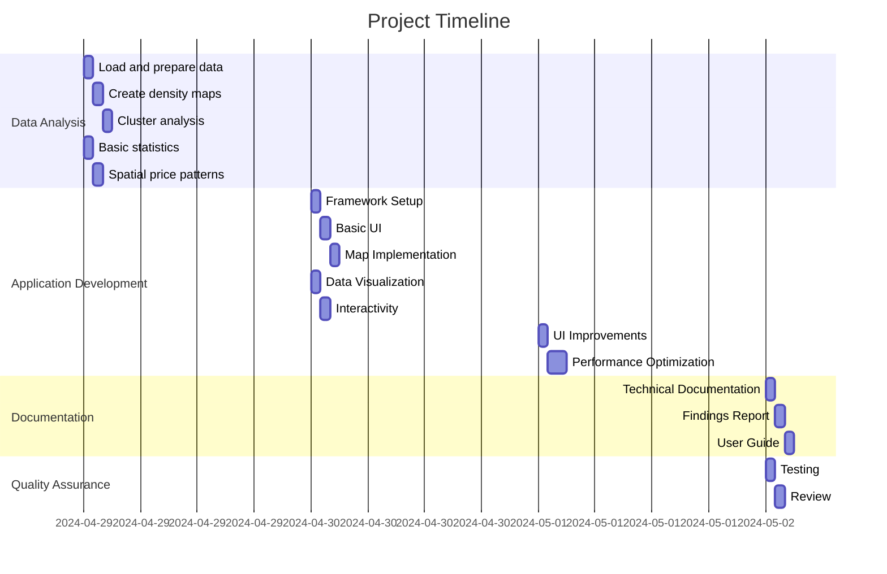

# Project Timeline (Gantt Chart)

```mermaid
gantt
    title Project Timeline
    dateFormat  YYYY-MM-DD
    section Data Analysis
    Load and prepare data      :a1, 2024-04-29, 1h
    Create density maps        :a2, after a1, 1h
    Cluster analysis           :a3, after a2, 1h
    Basic statistics           :a4, 2024-04-29, 1h
    Spatial price patterns     :a5, after a4, 1h

    section Application Development
    Framework Setup            :b1, 2024-04-30, 1h
    Basic UI                  :b2, after b1, 1h
    Map Implementation        :b3, after b2, 1h
    Data Visualization        :b4, 2024-04-30, 1h
    Interactivity            :b5, after b4, 1h
    UI Improvements          :b6, 2024-05-01, 1h
    Performance Optimization  :b7, after b6, 2h

    section Documentation
    Technical Documentation   :c1, 2024-05-02, 1h
    Findings Report          :c2, after c1, 1h
    User Guide               :c3, after c2, 1h

    section Quality Assurance
    Testing                  :d1, 2024-05-02, 1h
    Review                   :d2, after d1, 1h
``` 